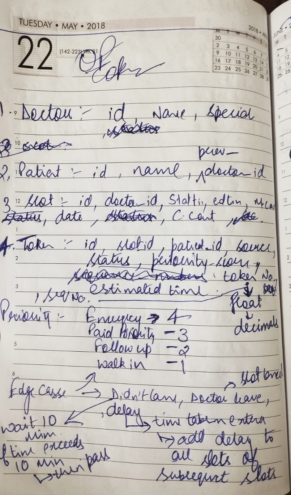
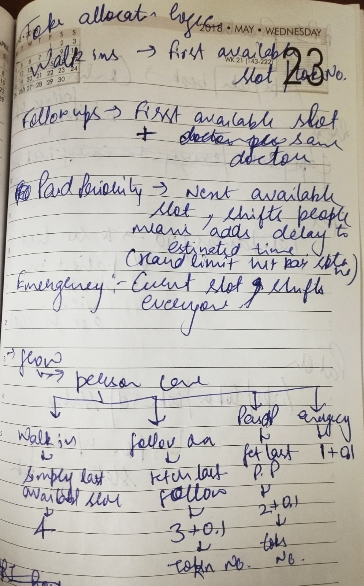
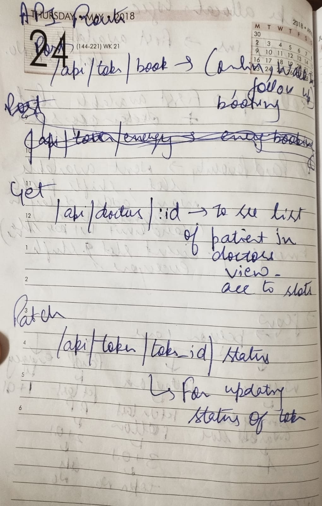

This conatins core API logic for dynamically allocation of token system for a doctor appointment in slots.

Tech stack used :

Backend : Nodejs + Express
Database : PostgreSql (SupaBase)

Database Model Desgin : 

Doctor : id , name , status,
Patient : id ,name , status,
Slot: id, doctorid ,slot_date, startTime , endTime , max_count , hard_limit , current_count
Token: id, slot_id , ptient_id , source , priority_score , token_no(chosen integer) , sequence_number(chosen as a float ,so that while fetching in seq/reallocation there should not be much problem ) , status , estimated_time , delay 

Priority Given : 

Emergency:1
Paid pirority : 2
Follow up : 3
Walk in:4

CORE Logic for allocation of tokens :

Here allocation is based on priority score and insertion between token according to priorty is based on sequence number 

It is basically a allocation according decimal sequence

Sequence number is the last allocated token in that slot to that priority (the sequence is only alloted if that slot is not filled and for emergency it hasnt hit the hard limit(buffer))

Doctor fetches the Token no. in ascending order of sequence numbers

lets say for walk in

First available slot fetched its sequence number will be 4.0 , now if another walk in person comes the first available slot will be fetched acc to priority score here 4 , and if there is a token in this slot exists then its sequence number will be 4.0+0.1=4.1  ,

Like eg . there is person with Token no. 1 and it has sequence no. 4
 if another person comes its token no. will be 2 and sequence will be 

  for walk in :  last fetched slot of walk in 4 + 0.1 = 4.1 

  new sequence  : token 1 , seq no. 4.0
                  token 2 , seq no. 4.1

Now for follow up / PAid pirority  / Emergency 

if another person comes after these 2 persons 

if it has emergency : IT skips the line and it has seq no. 1 at the top 

so new seq  : token 3 , seq no. 1
              token 1 , seq no. 4.0
              token 2 , seq no. 4.1

If it patient is a Paid priority : 

IT gets inserted just after the current/ emergency token and it has seq no. 2 at the top

so new seq  : token 3 , seq no. 1
              token 4 , seq no. 2
              token 1 , seq no. 4.0
              token 2 , seq no. 4.1

now let's say another person comes with the same paid priority it will be given toekn 5 seq no. 2.1

so new seq  : token 3 , seq no. 1
              token 4 , seq no. 2
              token 5 , seq no. 2.1
              token 1 , seq no. 4.0
              token 2 , seq no. 4.1

this is how the seq will be dynmically change according to the need and patients situations   

For real world scenario handled cancellation of tokens :

if the token is cancelled that token will be marked cancelled and the current count of that slot will be decremented by 1, making up the space

Added a failure handling using postgre transactions (BEGIN , COMMIT , ROLLBACK)

Api endpoints : 

/api/token/book :this is a POST req ,
                 this api  handles the core logic of the allocation accordin to priority and allocates the token 
                  
                 body content require is : patient id , doctor id , priority source

                 returns token

/api/doctor/:id  : this is a GET req 
                  this fetches the patients token in accordance to prioiryt acc to seq no.

/api/token/:id/status : this is a PATCH req
                        this updates the status of the tokens.

Simualtion : have created a file simualtion.js , simulation of one OPD day with 3 doctors.

HAdnwritten logic

 

    

            

